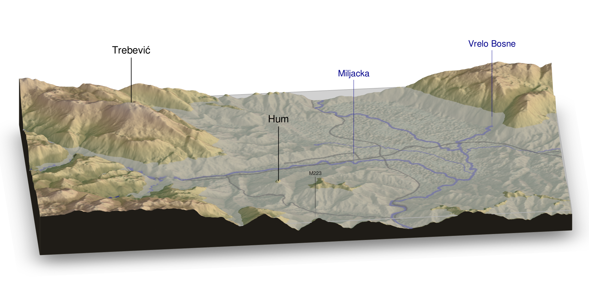

  
  ```{r setup, include=FALSE}
knitr::opts_chunk$set(echo = TRUE)
```

# Air pollution 


---

This repository holds project code, text, and documentation necessary for doing the analysis on the air pollution issues in Sarajevo (and B&H to that matter).

Right now only the code used to create the rayshader map used visualize effect of temperature inversions and creation of the smog layer in the valley. Much more to come, stay tuned... 


